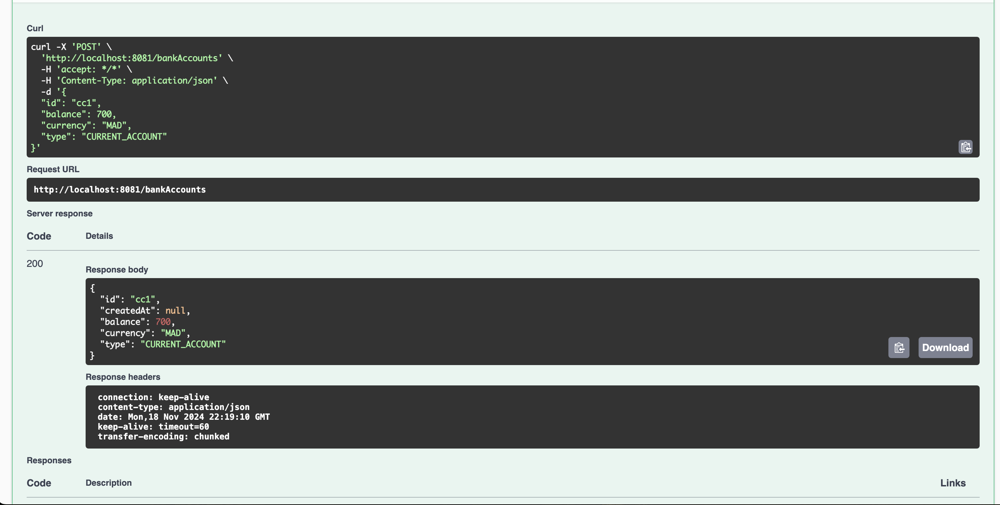
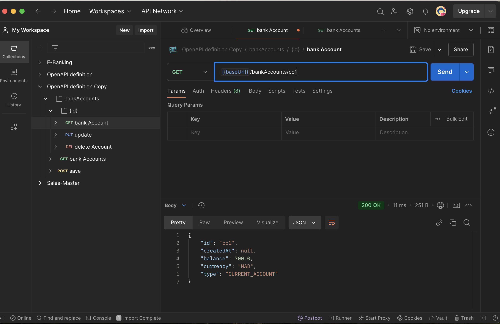
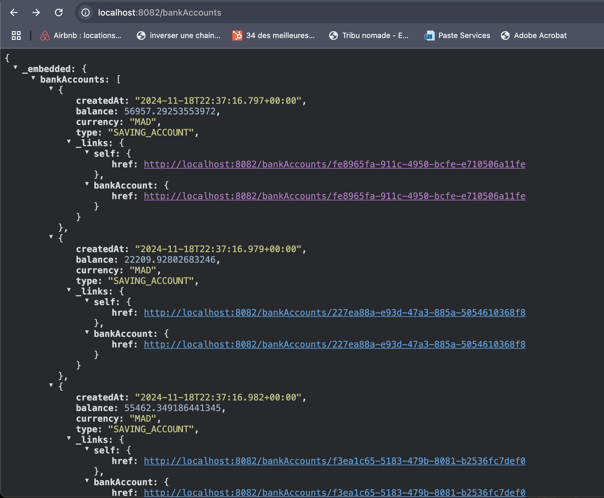
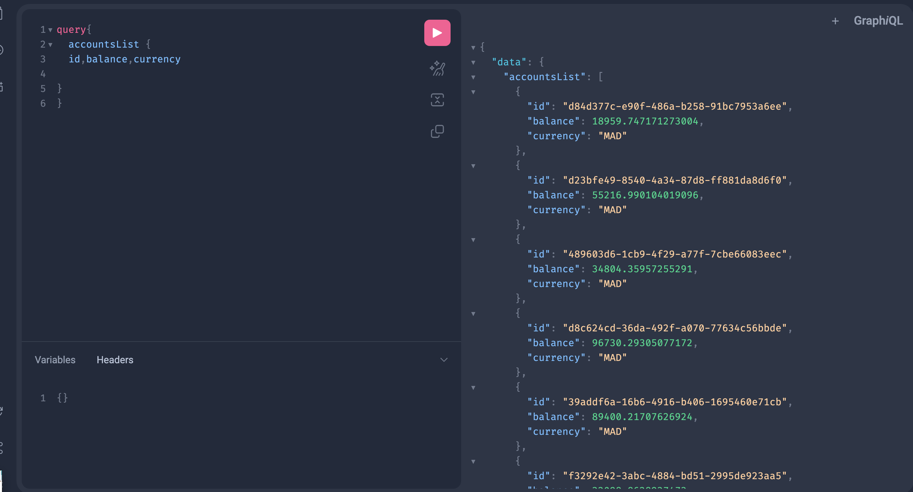
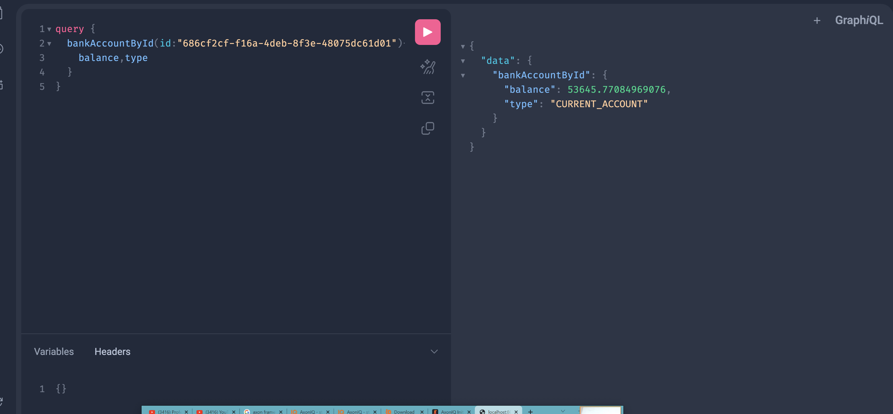
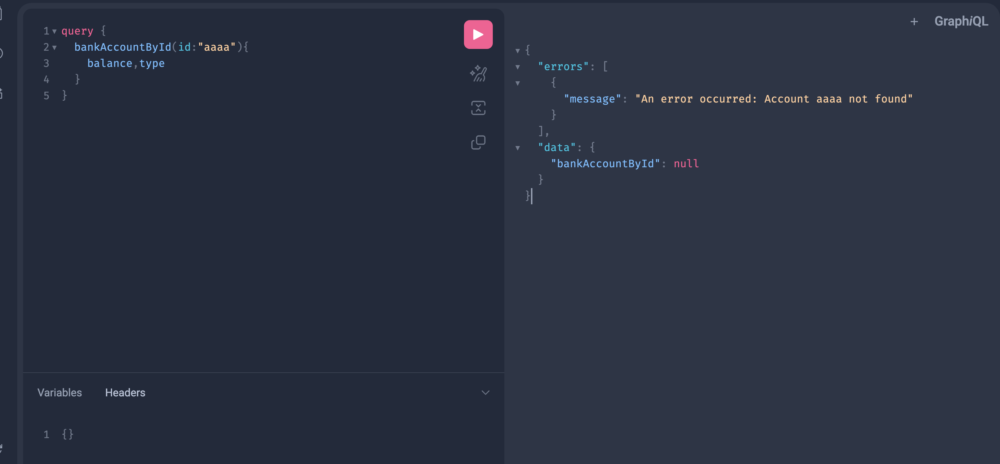
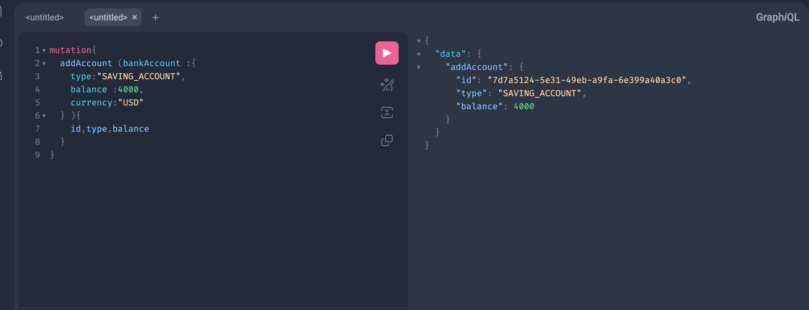
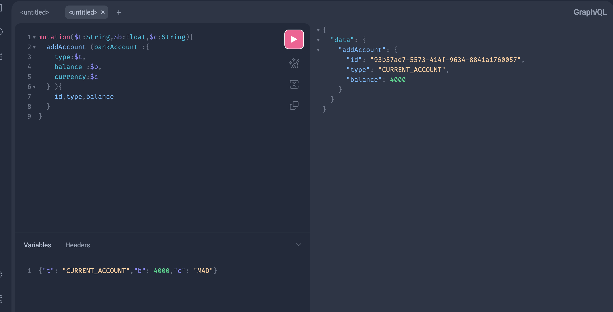
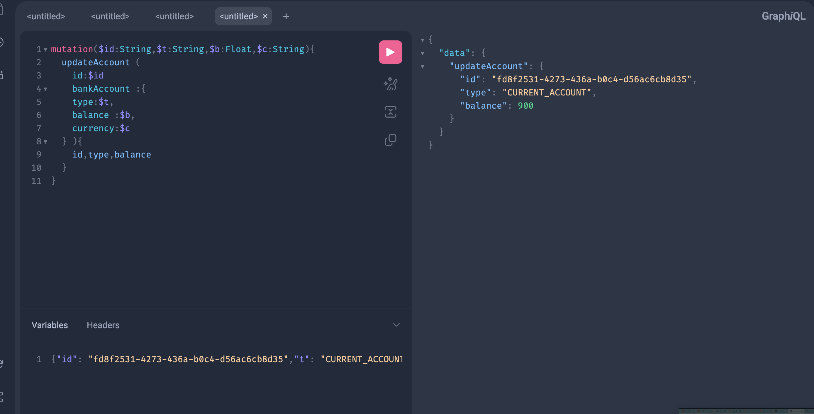

Générer et tester le documentation Swagger de des API Rest du Web service

Tester le web micro-service en utilisant un client REST comme Postman

Exposer une API Restful en utilisant Spring Data Rest en exploitant des projections

Créer un Web service GraphQL pour ce Micro-service en utilisant cette vidéo comme support

with handler :

Ajout d un compte :

Avec requete parametree:

update account:

delete account 
"# WS2" 
